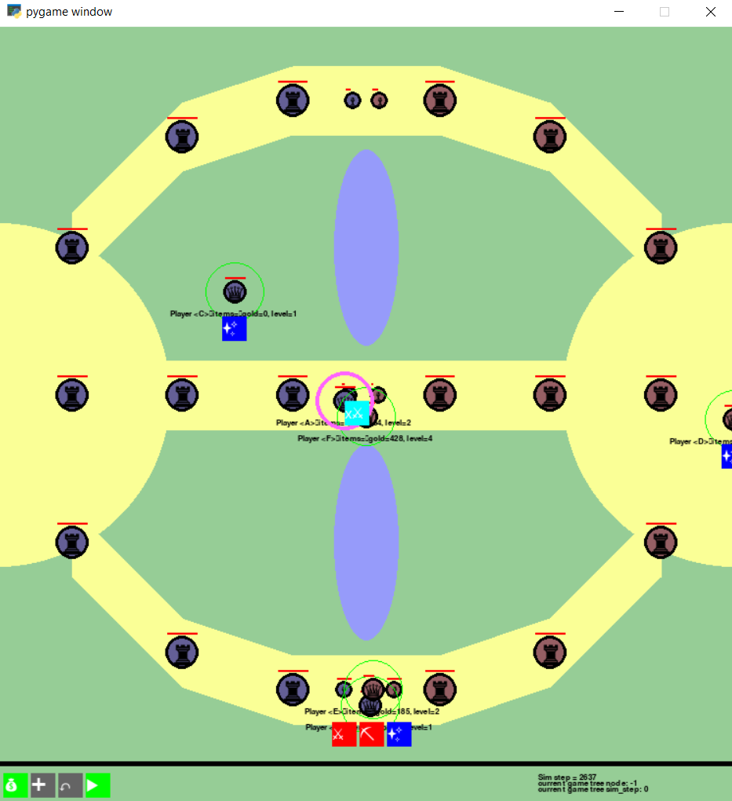

A simulator whose purpose is to allow practicing the "macro" elements of MOBA games without needing to think about the player mechanics.

Currently it supports:
    Waves/turrets
    Simplified combat, simple items
    Building up and traversing a game tree for planning/self-play
    Playing/pausing the simulation

